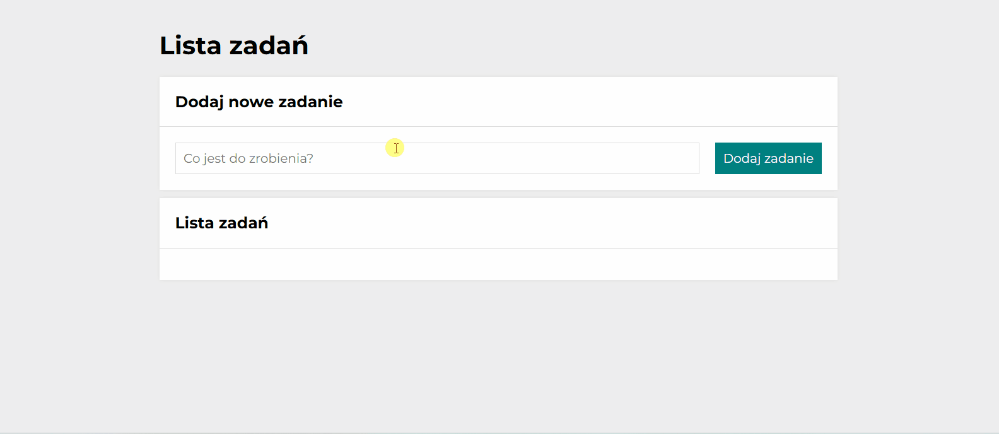

# To do list

The to-do list application makes creating and managing your daily tasks easy. The interface is intuitive, allowing you to enter new tasks in a designated field. You can write down a new task in the field, mark it as done or to-do using a green button, and delete it by clicking on the red one. It allows you to easily mark all tasks as done or hide all done tasks with one simple click. 

It is a basic to-do list application that offers all the essential features needed to effectively manage your daily activities.

## Demo

https://katarzynamaculewicz.github.io/To-do-list/

## Technologies

- HTML
- CSS
- JavaScript
- BEM convenion
- ES6 + features
